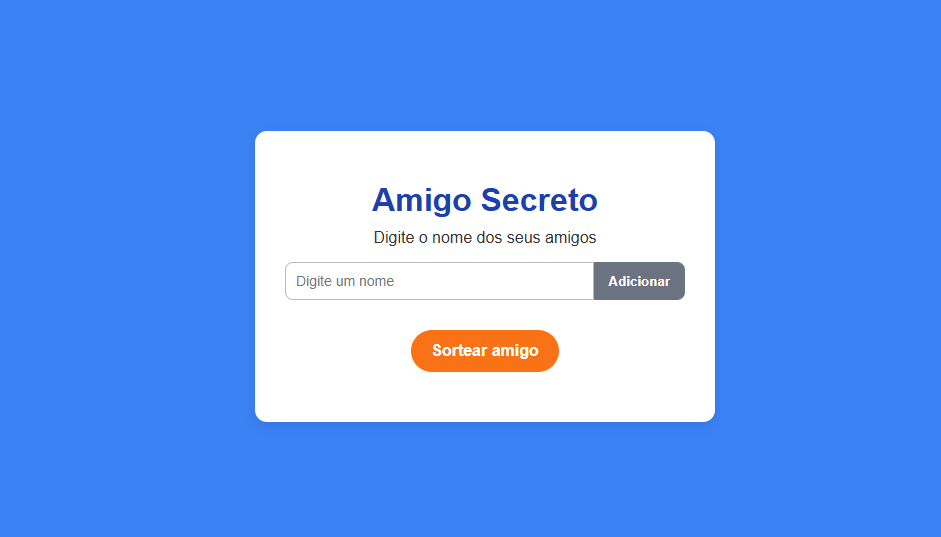

🎁 Amigo Secreto

Aplicação simples em HTML, CSS e JavaScript para gerenciar nomes de amigos e realizar o sorteio de um Amigo Secreto de forma interativa.

📌 Funcionalidades

➕ Adicionar nomes: insira o nome no campo de texto e clique em Adicionar.

✅ Validação: impede adicionar nomes vazios.

📃 Visualizar lista: os nomes adicionados ficam visíveis em uma lista.

🎲 Sortear amigo: sorteia um nome aleatório da lista e exibe o resultado na tela.

🖼️ Layout

O design é inspirado em uma interface limpa e amigável:

Fundo azul.

Caixa branca centralizada com título e campo de entrada.

Botão cinza para Adicionar nomes.

Botão laranja e arredondado para Sortear amigo.

Exemplo:

🚀 Tecnologias

HTML5

CSS3

JavaScript (ES6+)

📂 Estrutura do Projeto
📁 amigo-secreto
 ┣ 📄 index.html
 ┣ 📄 style.css
 ┣ 📄 script.js
 ┗ 📄 README.md

▶️ Como executar

Clone este repositório:

git clone https://github.com/Maira-Alves/Amigo-Secreto.git

Acesse a pasta do projeto:

cd amigo-secreto

Abra o arquivo index.html no navegador.

Pronto! 🎉

🔮 Melhorias futuras

Permitir remover nomes da lista.

Impedir nomes duplicados.

Exportar lista de participantes.

Melhorar design para mobile.

📜 Licença

Este projeto é de uso livre.
